SaranStore is a Flutter-based e-commerce mobile application built using Clean Architecture, BLoC State Management, GoRouter, and REST API integration with Dio. The project follows a scalable and maintainable architecture with a strict separation of Data, Domain, and Presentation layers, ensuring clean code principles and production-ready structure.

The application delivers a complete end-to-end shopping experience starting from an animated splash screen, category browsing, category-based product listing, product search, and sorting functionality. It supports full product management features including Create, Read, Update, and Delete operations with optimistic UI updates for a smooth and responsive user experience. Products and categories are dynamically fetched from APIs, with support for cached image loading, reusable custom widgets, form validation, dependency injection, and a responsive UI optimized for mobile portrait mode.

SaranStore includes a fully functional shopping cart system with add-to-cart, quantity increment and decrement, item removal, and real-time cart total calculation, providing a seamless checkout experience. Navigation across the application is handled using GoRouter, ensuring a clean, scalable, and maintainable routing structure.

The project has also evolved into a more complete e-commerce solution with the addition of product detail pages and user reviews, enhancing product exploration and user engagement. Firebase integration has been implemented, including Android app registration, FlutterFire configuration, and Firebase initialization. Authentication features are fully supported with email/password login, signup, logout, and Google Sign-In, making the application more secure and production-ready.

Overall, SaranStore is a continuously evolving project that demonstrates modern Flutter development practices, focusing on state management with BLoC, advanced navigation, backend integration, authentication flows, and clean architecture principles to build a real-world, scalable e-commerce application.

## Screenshots

### Splash

### Login

### Signup

### Login with validation (1)

### Login with validation (2)

### Signup with validation

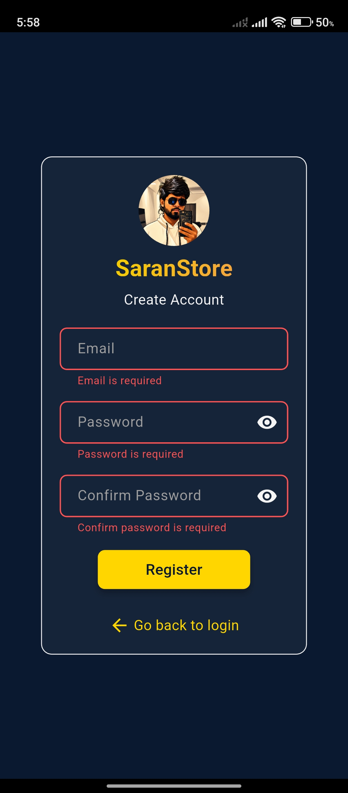

### Categories Screen

### Category Search

### Products Screen

### Product details

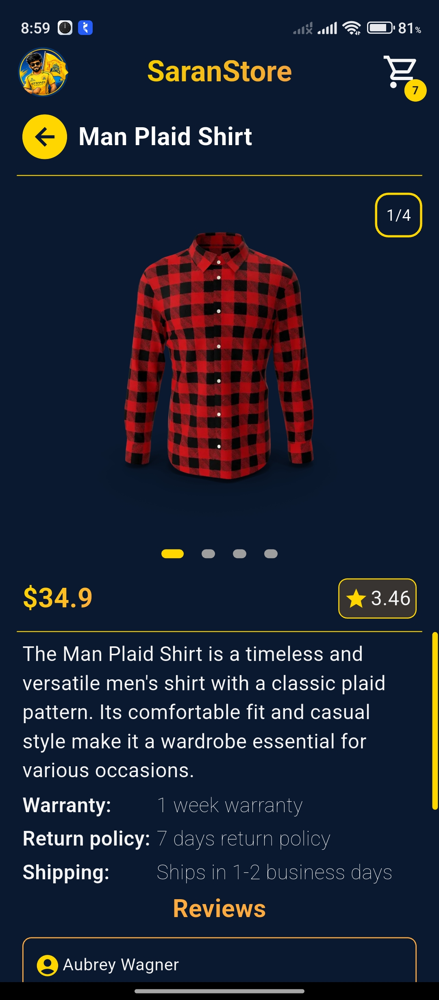

### Product reviews (1)

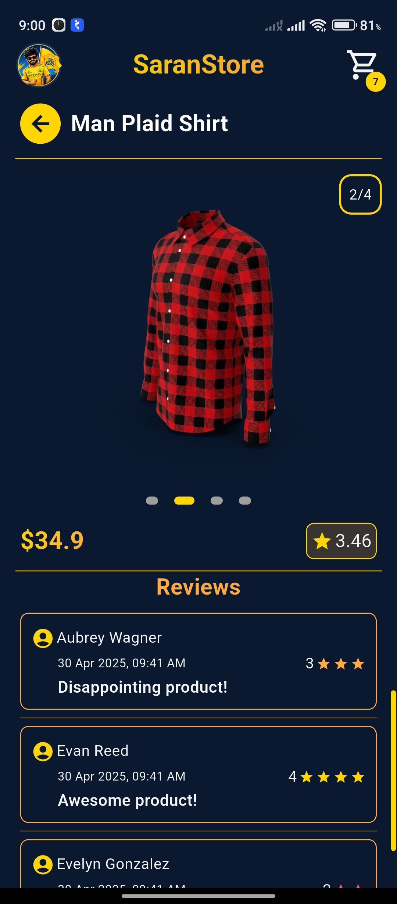

### Product reviews (2)

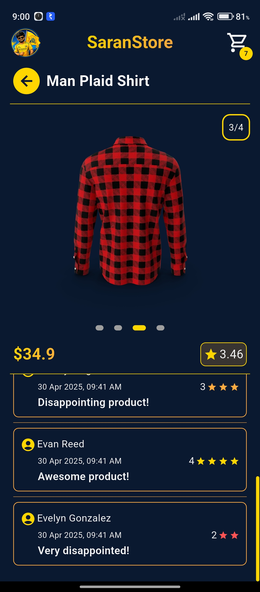

### Product Search

### Products Sort

### Add Product

### Edit and Delete Product

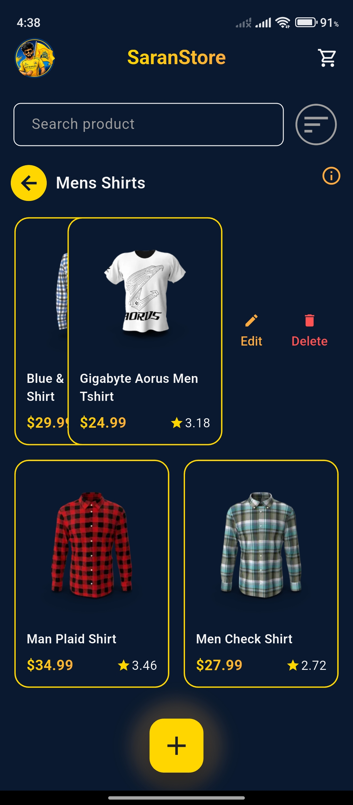

### Edit Product

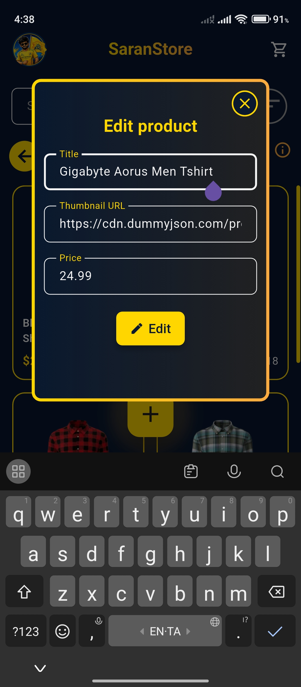

### Delete Product

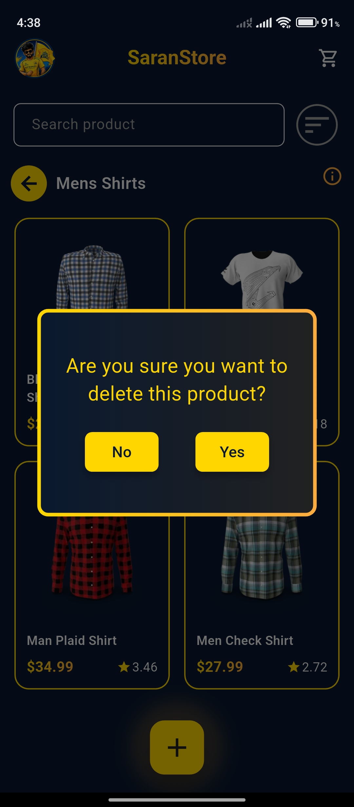

### Add to cart (1)

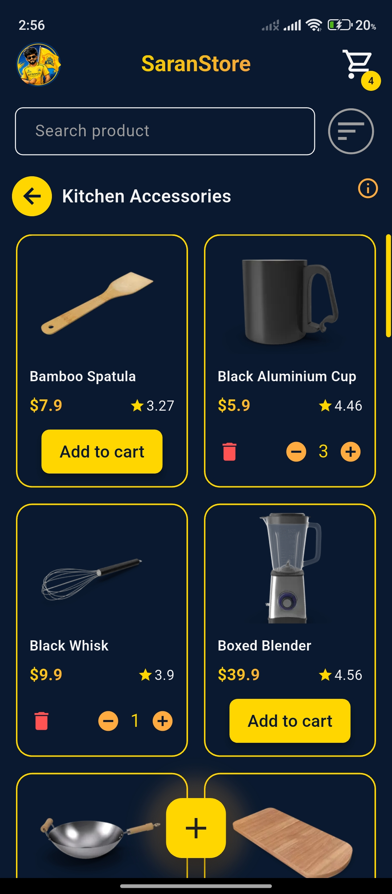

### Add to cart (2)

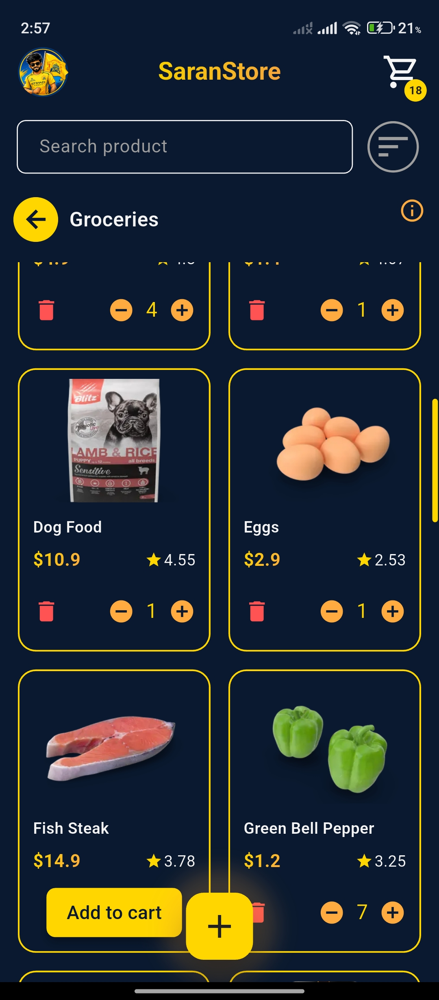

### Cart page

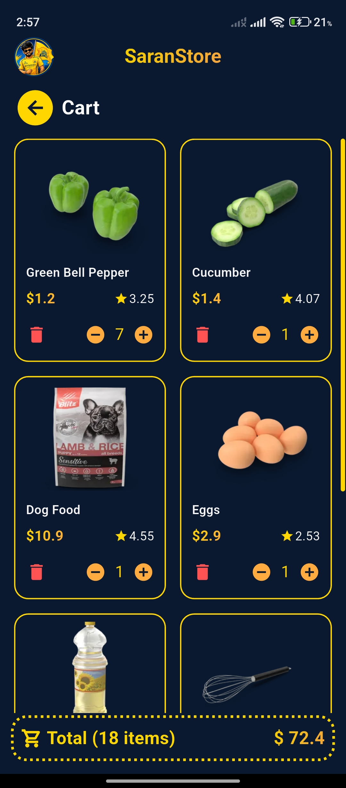

### Remove from cart

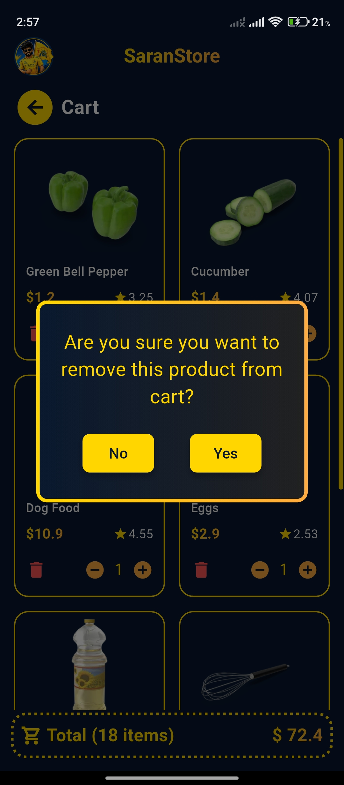
