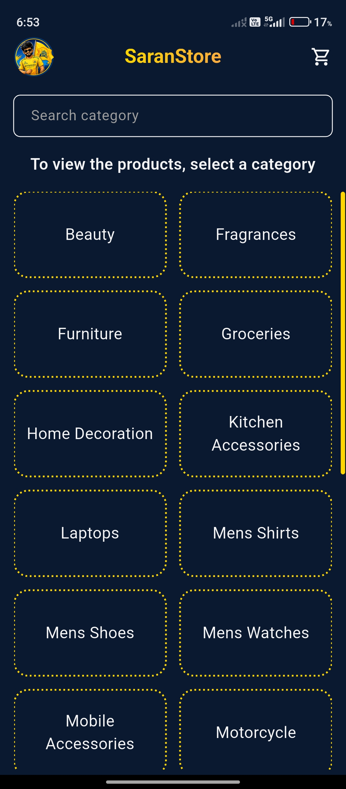
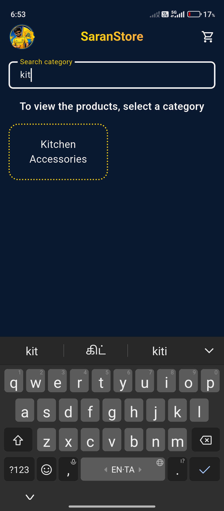
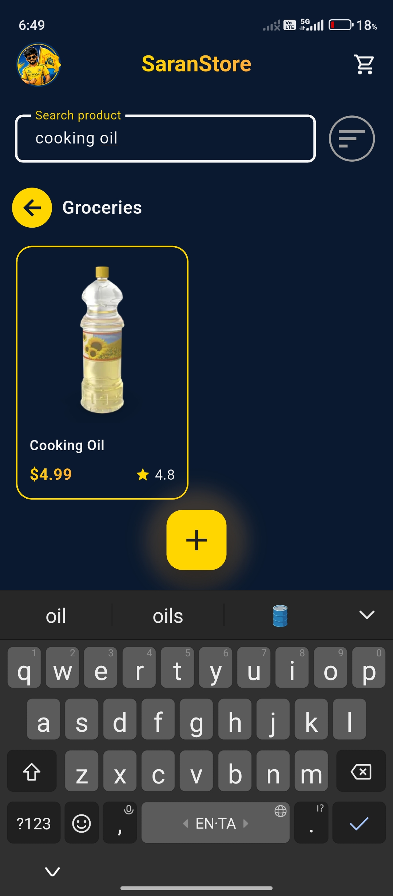
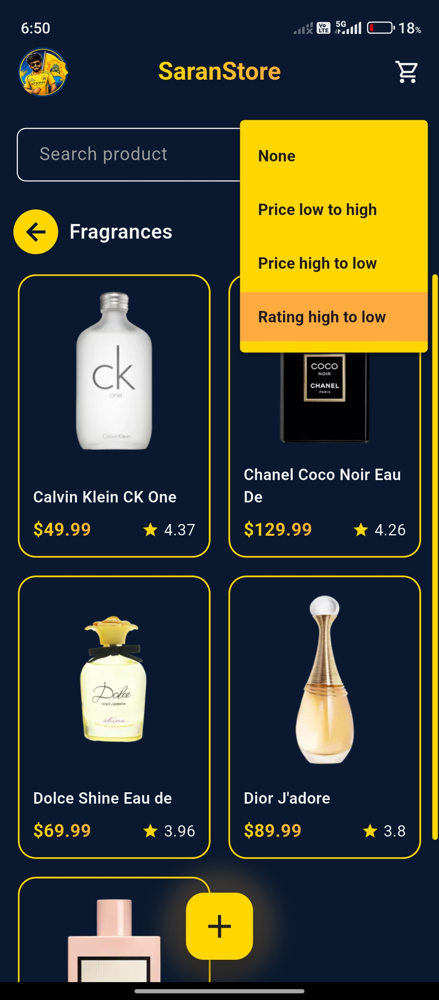
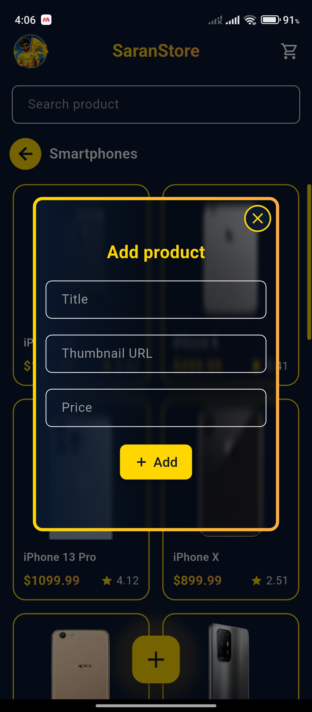

SaranStore is a Flutter-based e-commerce application built using Clean Architecture, BLoC State Management, and REST API integration with Dio. The application demonstrates a scalable and maintainable project structure with separate Data, Domain, and Presentation layers.

Features include product listing, category-based filtering, product search, and complete CRUD operations (Create, Read, Update, Delete) with optimistic UI updates. Products and categories are fetched dynamically from APIs, and the application uses cached image loading, custom reusable widgets, form validation, dependency injection, and responsive UI design.

This project was developed as a hands-on implementation of modern Flutter development practices, focusing on state management, API consumption, repository pattern, clean code principles, and production-ready architecture.

## Screenshots

### Splash

### Categories Screen

### Category Search

### Products Screen

### Product Search

### Products Sort

### Add Product

